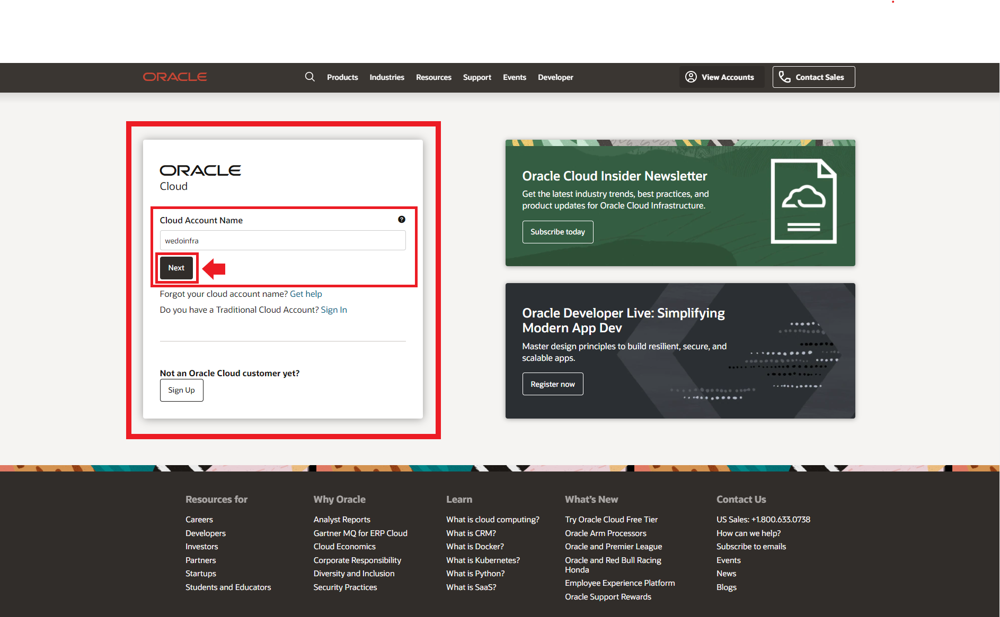
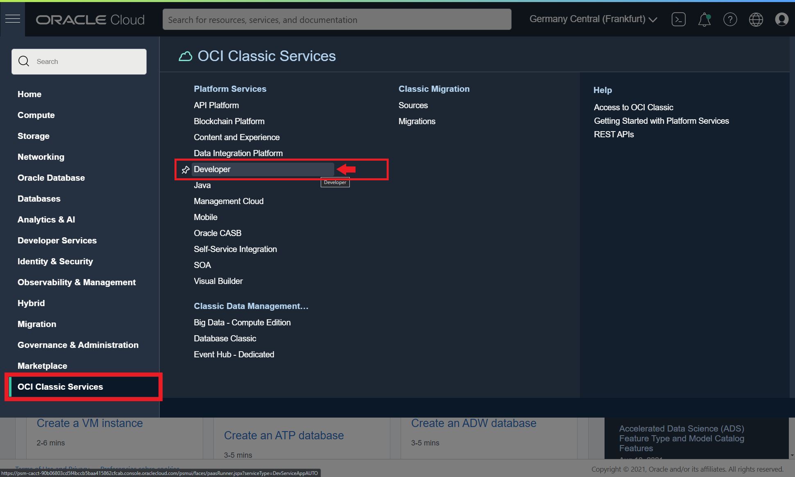
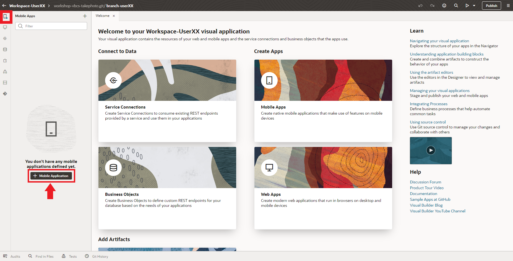
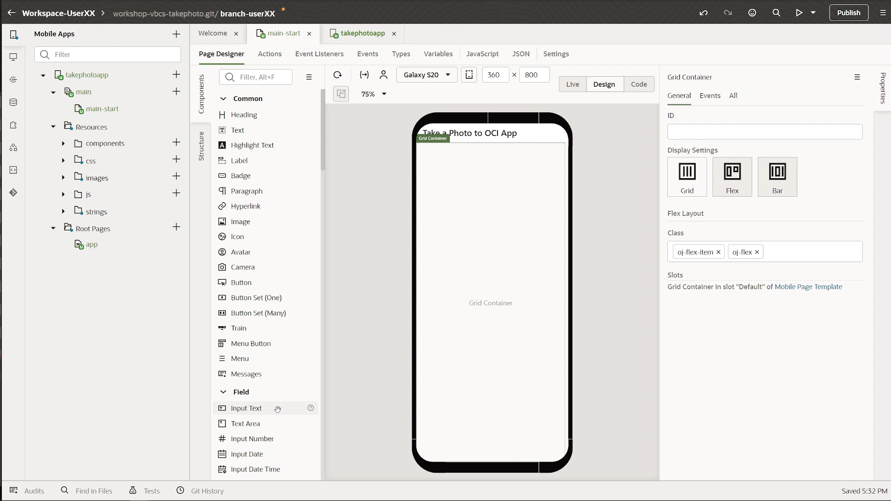

# Visual Builder workshop.
This workshop will teach you how to create a new Oracle Visual Builder mobile application, that will allow you to take a photo with the mobile camera and upload it to Oracle Cloud (OCI) Object Storage.

  
1.- Creating the API Key.

---
You will have to connecto the Visual Builder app to OCI Object Storage Bucket to Store the mobile photo or image files. You must create an API key OCI element to access to the OCI Services via API REST. Let's create the API Key.
  
---
  
## Creating the API Key
First Sign in [OCI web console](https://cloud.oracle.com) with your credentials 
> Note: this credentials will be provided to you in the workshop by the trainers, or you can use youw own credentials if you have a trial or paid tenancy.

Write your tenancy name and click **Next** Button.

Then click Continue leaving the Identity Providers as *oracleidentitycloudservice*

Next write you *User Name* and *Password* and click in **Connect** Button to access to OCI web console.

Then click in the **Profile icon** at the top right of the console to access to the user **Settings**.

Scroll down and click **API Keys** in the *Resources menu*

Next click **Add API Key** button to add a new API Key.

Select **Generate API Key Pair**. 
> Note: you could use your own public and private keys in pem format, but in this workshop and for academical purposes we'll use the auto generathed keys.

Next you must to download the *Private* and *Public* Keys to your laptop/desktop.

After that, you might have two **.pem** files one mark as public.

Then click in **Add** button.

Next window is the summary or **Configuration File Preview**. Click in the **copy** link to copy your OCI API credentials to a text file in you local computer as you will need them in future steps in the workshop. Then click **Close** Button to finish the process.

You might have a new API key created and you should see the Fingerprint key in the OCI web console. 

You can get the Config file that you copied before clicking in the *tree vertical* dots in the Fingerprint row and select **View Config File**.

  
2.- Acessing Visual Builder Studio and WorkSpace using Visual Builder Cloud Service

  
---
  To develop your Visual Builder Application you must access to the workshop Visual Builder Studio instance. Visual Builder is not only used to develop Visual Builder applications, but it allows the development of any kind of modern application thanks to its multitude of integrated development tools, such as a GIT repository, CI/CD pipelines engine, artifact generation, container repository, agile tools, team building tools like wiki and snipples and more. If you want to know more please click [here](https://www.oracle.com/application-development/visual-builder-studio/)
 
---
  
## Acessing Visual Builder Studio and WorkSpace using Visual Builder Cloud Service
To get access to Visual Builder Studio (VBS) you have to Sign-in Oracle Cloud web console with your tenancy user credentials. Then Click in the *hamburguer icon* in the top left part of the web console and select **OCI Classic Services** then click in **Developer** to access to Visual Builder Studio instance.

  
Next you have to click in the VBS instance **menu icon** and click in the **Access Service Instance**
  
  
 
Then in **Organization**, select the *Project* -> **Workshop-VBCS-Takephoto** that you will use for this workshop. 
  

  
Select *Workspaces* in the left menu to get all the workspaces in the project. Then select the appropiate workspace asigned to you by the trainer. In this tutorial, you will see that the screenshots show *userXX*, but you will have to change XX with your user number.
> Note: if the trainer asign you the numbre 01 or user01, your workspace will be something like **workspace-user01**.
  
All trainees will use their own git repository tied to their own workspace.
  

  
Wait a couple of second to access to your workspace. You should see the *Welcome to your Workspace* page.
  

    

  
3.- Creating a Mobile App in Visual Builder.

  
---
In this section you will create a mobile application with Visual Builder low coding programing. This application will have several components like an API REST connection to Oracle Cloud Object Storage bucket to storage your photos or files, a mobile layout with input fields and button to take the photo, a workflow triggered by the button event handler and more. At the end of the section you will can take a photo with you mobile phone and upload it to an OCI Object Stogare bucket.
 
---
  
## Creating a Mobile App in Visual Builder.
In Visual Builder you can create web applications as well as mobile applications. As a low coding programing platform you have a lot of preconfigured UI components to create an application layout for you business case. But you can use javascript (nodejs notation) if you want to have more control over your application. The limit is your imagination.

  
3.1 Creating the mobile layout

### Creating the mobile layout.
Now you will create the mobile layout adding several components that you will use and combine in future sections to create the mobile application.
  
Click in the mobile left menu icon and then click **+ Mobile Application** button to create a mobile application.
  

  
In *General Information* you must to write a descriptive name for your mobile app, like **takephotoapp**. Then select none as mobile layout app, because in this workshop we won't create a navigation menu for the app as it has only one screen. Finally click **Next** button to continue.
  

  
Keep **Custom** layout selected (empty layout) and click **Create** button to create you mobile app.
  

Now you should have created the visual builder mobile application environtment/sandbox to continue creating your mobile app. You should see the *Page Designer* selected with a simple mobile layout in the Design window.
  

  
You can change the mobile appearance (iphone, google pixel, samsung or tablet), show or hide the bezel or change the mobiile size. In the tutorial we select Samsung Galaxy S20 layout, but you can select whatever you want (default layout is for iphone mobile phones).
  

  
Click in **Page Title** to select the *Mobile Page Template* properties. Then change the page title to a descriptive one like **Take a Photo to OCI App**
  

  
Select **Flex Container** layout to change it.
  

  
Change the *Display Settings* to **Grid** layout.
  

  
Scroll down in the Components menu to Layout and darg and drop **Form Layout** to the Design window.
  

  
Scroll up or search an **Input Text** component and drag and drop to the Design window, inside the *Form Layout*.
  

  
Now you will create other **Input Text** but dragging and drop in the Structure menu, instead of drag and drop over Design window. Drag and Drop over the Structure menu gives you more control when you are creating the mobile layout.
  

