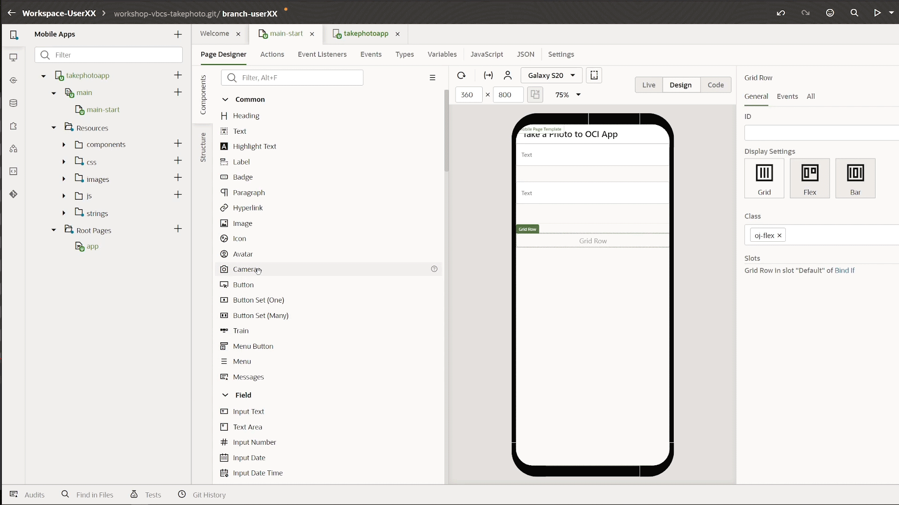
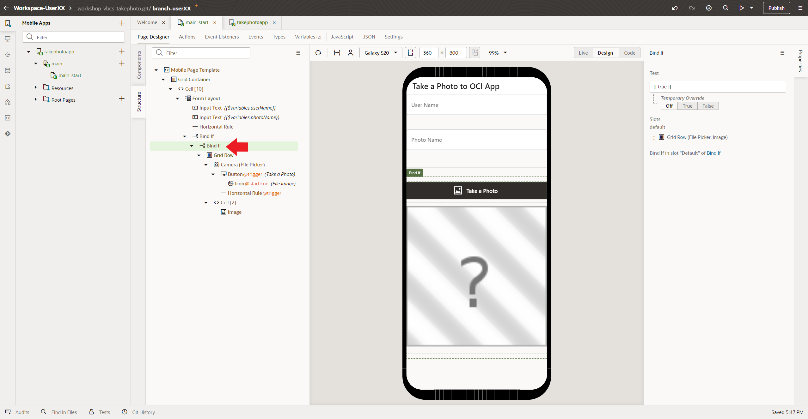
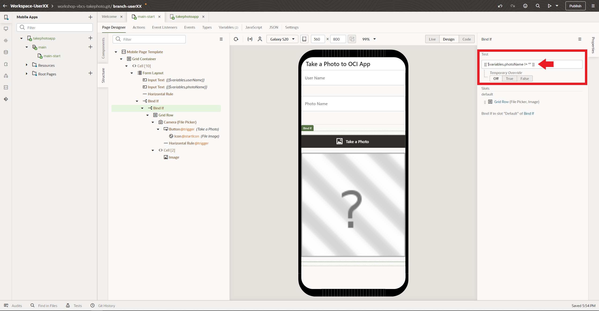
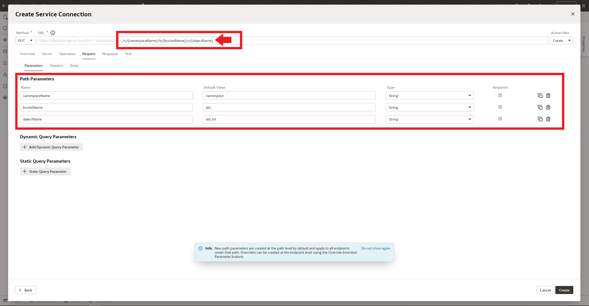
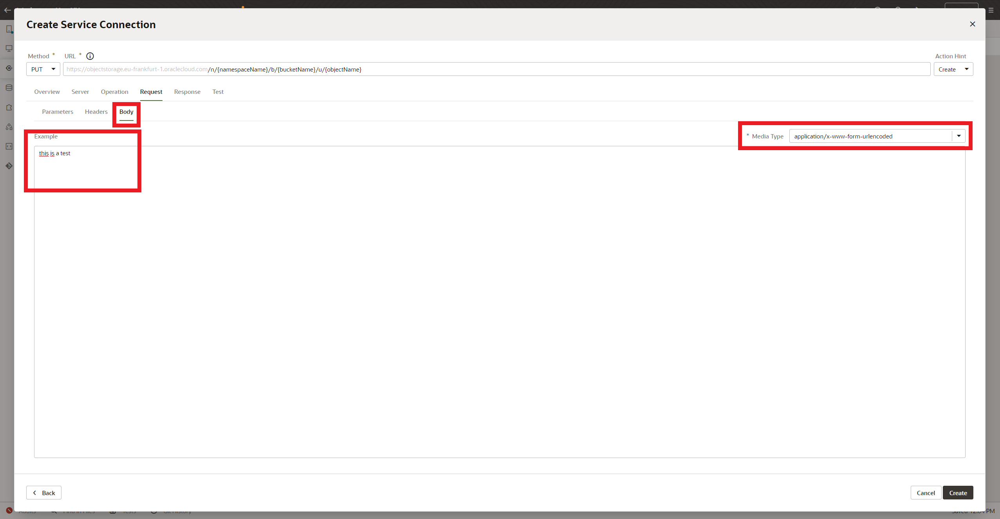
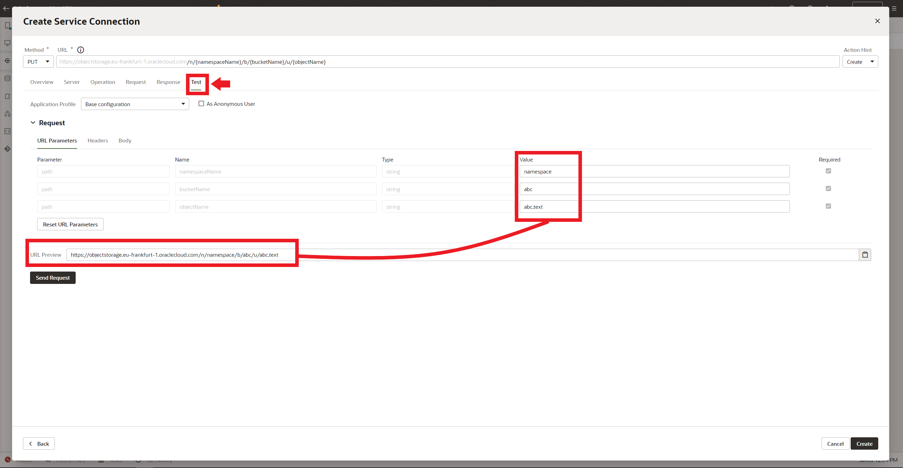

# Visual Builder workshop.
This workshop will teach you how to create a new Oracle Visual Builder mobile application, that will allow you to take a photo with the mobile camera and upload it to Oracle Cloud (OCI) Object Storage.

You have a detailed manual about Visual Builder [here](https://docs.oracle.com/en/cloud/paas/app-builder-cloud/visual-builder-developer/index.html)

<details>
  <summary>1.- Creating the OCI API Key (click to show)</summary>

---
You will have to connect the Visual Builder app to OCI Object Storage Bucket to Store the mobile photos or image files in a bucket. You must create an OCI API Key to get access to the OCI Services via API REST. So let's create the API Key.
  
---
  
## Creating the API Key
First Sign in [OCI web console](https://cloud.oracle.com) with your credentials 
> Note: this credentials will be provided to you in the workshop by the trainers, or you can use youw own credentials if you have a trial or paid tenancy.

Write your tenancy name and click **Next** Button.


Then click Continue leaving the Identity Providers as *oracleidentitycloudservice*


Next write you *User Name* and *Password* and click in **Connect** Button to access to OCI web console.


Then click in the **Profile icon** at the top right of the console to access to the user **Settings**.


Scroll down and click **API Keys** in the *Resources menu*


Next click **Add API Key** button to add a new API Key.


Select **Generate API Key Pair**. 
> Note: you could use your own public and private keys in pem format, but in this workshop and for academical purposes we'll use the auto generathed keys.


Next you must to download the *Private* and *Public* Keys to your laptop/desktop.


After that, you might have two **.pem** files one mark as public.


Then click in **Add** button.


Next window is the summary or **Configuration File Preview**. Click in the **copy** link to copy your OCI API credentials to a text file in you local computer as you will need them in future steps in the workshop. Then click **Close** Button to finish the process.


You might have a new API key created and you should see the Fingerprint key in the OCI web console. 


You can get the Config file that you copied before clicking in the *tree vertical* dots in the Fingerprint row and select **View Config File**.


</details>
<details>
  <summary>2.- Acessing Visual Builder Studio and WorkSpace using Visual Builder Cloud Service (click to show)</summary>
  
---
  To develop your Visual Builder Application you must access to the workshop Visual Builder Studio instance. Visual Builder is not only used to develop Visual Builder applications, but it allows the development of any kind of modern application thanks to its multitude of integrated development tools, such as a GIT repository, CI/CD pipelines engine, artifact generation, container repository, agile tools, team building tools like wiki and snipples and more. If you want to know more please click [here](https://www.oracle.com/application-development/visual-builder-studio/)
 
---
  
## Acessing Visual Builder Studio and WorkSpace using Visual Builder Cloud Service
To get access to Visual Builder Studio (VBS) you have to Sign-in Oracle Cloud web console with your tenancy user credentials. Then Click in the *hamburguer icon* in the top left part of the web console and select **OCI Classic Services** then click in **Developer** to access to Visual Builder Studio instance.


  
Next you have to click in the VBS instance **menu icon** and click in the **Access Service Instance**
  
  
 
Then in **Organization**, select the *Project* -> **Workshop-VBCS-Takephoto** that you will use for this workshop. 
  

  
Select *Workspaces* in the left menu to get all the workspaces in the project. Then select the appropiate workspace asigned to you by the trainer. In this tutorial, you will see that the screenshots show *userXX*, but you will have to change XX with your user number.
> Note: if the trainer asign you the numbre 01 or user01, your workspace will be something like **workspace-user01**.
  
All trainees will use their own git repository tied to their own workspace.
  

  
Wait a couple of second to access to your workspace. You should see the *Welcome to your Workspace* page.
  

    
</details>
</details>
<details>
  <summary>3.- Creating a Mobile App in Visual Builder (click to show)</summary>
  
---
In this section you will create a mobile application with Visual Builder low coding programing. This application will have several components like an API REST connection to Oracle Cloud Object Storage bucket to storage your photos or files, a mobile layout with input fields and button to take the photo, a workflow triggered by the button event handler and more. At the end of the section you will can take a photo with your mobile phone and upload it to an OCI Object Stogare bucket.
 
---
  
## Creating a Mobile App in Visual Builder.
You can create web applications as well as mobile applications in Visual Builder. As a low coding programing platform you have a lot of preconfigured components to create an application for your business case. But you can use javascript (nodejs notation) if you want to have more control coding your application. The limit is your imagination!!.

<details>
  <summary>3.1 Creating the mobile layout (click to show)</summary>
  
### Creating the mobile layout.
Now you will create the mobile layout adding several components that you will use and combine in future sections to create the mobile application.
  
Click in the mobile left menu icon and then click **+ Mobile Application** button to create a mobile application.
  

  
In *General Information* you must to write a descriptive name for your mobile app, like **takephotoapp**. Then select none as mobile layout app, because in this workshop we won't create a navigation menu for the app as it has only one screen. Finally click **Next** button to continue.
  

  
Keep **Custom** layout selected (empty layout) and click **Create** button to create you mobile app.
  


Now you should have created the visual builder mobile application environtment/sandbox to continue creating your mobile app. You should see the *Page Designer* selected with a simple mobile layout in the Design window.
  

  
You can change the mobile appearance (iphone, google pixel, samsung or tablet), show or hide the bezel or change the mobiile size. In the tutorial we select Samsung Galaxy S20 layout, but you can select whatever you want (default layout is for iphone mobile phones).
  

  
Click in **Page Title** to select the *Mobile Page Template* properties. Then change the page title to a descriptive one like **Take a Photo to OCI App**
  

  
Select **Flex Container** layout to change it.
  

  
Change the *Display Settings* to **Grid** layout.
  

  
Scroll down in the Components menu to Layout and drag and drop **Form Layout** to the Design window.
  

  
Scroll up or search an **Input Text** component and drag and drop to the Design window, inside the *Form Layout*.
  

  
Now you will add other **Input Text** but you'll drop it in the Structure menu instead of drop it over the Design window. Drag and Drop over the Structure menu gives you more control when you are creating the mobile layout.
  

  
Next you will add a **Horizontal Rule** from *Layout* components to the Design window.
  

  
Now you have to scroll down and add an **If** component from *Layout* menu to the Structure tree. 
> Note: This component will allow you to compose match rules to create different behaviours according to that rules. In this workshop you will use the **If** component to show or hide the *take photo button*, that you'll have to add to the Design window in next steps.
  

  
Add other **If** component more to the *Structure tree*, but this time you have to add it inside (nested) the last *If* that you created before.
> Note: You have to create two nested if components, one for each **Input Text** added before.


  
Next you have to add a **Grid Container** component from *Layout* menu, nested to the last *if* component in the *Structure* tree. Drag the **Grid Container** component and drop it inside the last **Bind If**.
> Note: The Grid Container (show as *Grid Row* in the Structure tree) will contain the next components that you have to crete and you'll use it to show or hide its content according to the match rules that you will create in the *If* components in future steps.
  

  
Now you have to add a **Camera** Component from *Commom* menu, nested to the Grid Row that you create in the last step.
> Note: The Camera component is made up of three components: a **File Picker** and a **Button** with an **Icon**. The File Picker component will have a special behaviour as the action that it will execute, will be triggered by the button instead of the own File Picker component.
  

  
Next add other **Horizontal Rule** component from *Layout* components menu as a separator. You must drag the **Horizontal Rule** and drop inside the **Camera** component in the *Structure* tree.
  

  
Last Layout component will be an **Image** one. Drag the **Image** component from the *Common* components menu and Drop inside the **Grid Row**. **Image** component should be at the same level as the **Camera** component.
  


Now you should have a Structure tree similar to the next screenshot. You can move components in the Structure tree if your layout structure is different.
  

  
</details>
<details>
  <summary>3.2 Configuring the components created (click to show)</summary>
  
---
  
In this section you'll configure the components to improve the UI and user experience. For example you'll use the **If** components to show or hide the camera button and the image components.

---
  
## Configuring the components created.
Now that you have created the mobile app UI layout, you have to configure the different components. Let's configure the components!!

The photo name will be the join of the first Input Text field (User Name), the second Input Text field (Photo Name) and a random number that the phone use when you take a photo with the camera. The result should be something similar to 
```sh  
userXX-photoXX-0934750743058743095.jpg
```
  
Click in the first *Text Input* component to get access the **General** component fields. This component will be used to storage the user name that will take the photo. 
  

  
In the **Label Hint** write *User Name* and keep rest of the fields as default.
  


Repeat the same steps to put **Photo Name** in the second *Input Text* field. 


Now click in the *Camera* component and in the General tab deselect **Video** check, as you'll have to take photos only. 


  
Then click in the *Button* component inside the Camera one. Change the Text field deleting the **/Video** part. Then Select **Call to Action** in the Choming field and check *Full width* in Styling. 
  
|Field|Value|  
|-|-|
|Text|Take a Photo|
|Chroming|Call To Action|
|Styling| Full Width |
  


Click in the *Image* component and put in the **Width** field the first number of pixels located in the Viewport Resolution (for Samsung Galaxy S20 is **360** pixels).
  
  
</details>
<details>
  <summary>3.3 Manage Component Visibility Using Conditions and Variables (click to show)</summary>

--- 
  
You can use a **bind-if** component to conditionally show or hide UI components in your visual application. Use **bind-if** to surround other components and set conditions to determine whether the components should be displayed on a page. In this lab you'll configure two **bind-if** components, one for each *Input Text* value. To manage the value of the **Input Text** components you'll have to create variables. These variables will be used in the events and actions to those events in future steps.
  
> Note: For academic reasons and to facilitate the creation of the mobile UI, the **bind-if** components were created before adding the components affected by them. To use an **bind-if** component to control when a component is displayed in a page after you added it: In **Design** mode, locate the component that you want to control dynamically. *Right-click* the component on the canvas or in the *Structure* view and select **Surround > If** in the popup menu. 
  
  
  
---
  
### Manage Component Visibility Using Conditions and Variables
Before the **Bind-If** configuration, you'll have to create several variables to store the *Input Text* value. Let's create the variables and then you'll can create the rules to control de visibility of the components.
  
Click **Variables** in the main-start tab to get access to the variables configuration window. You shouldn't have any variable created yet. Click **+ Variable** to create the first variable for you main-start page.
  
  
  
Write a variable name like **userName** in the *ID* field and keep **String** as variable *Type*. Then Click **Create & New** to save and create the second variable.
  

  
Repeat the last step and write a variable name like **photoName** in the *ID* field and keep **String** as variable *Type*. This time click in **Create** button as you don't have to create other variable right now.
  

  
Now you have to link this two variables with each **Input Text** components. Click in **Page Designer** again to return to the Design window and Select the *User Name* **Input Text** but **Data** tab properties instead of General one.
  

  
Then hover the mouse in the Value field and click **fx** (Expression Editor) icon.
  

  
The Expression Editor window should appear. Then Drag **userName** variable and Drop in the first line. Click **Save** button to finish the linking process.
  

  
Repeat the last step with the **Photo Name** component.
  

  
Now you have linked the variables with the components values and you will can use them in several parts of your mobile application. For example you will use them in the next steps to modify the visibility of the Camera and Image components.
  
To modify the visibility you have to use the **Bind-If** components. Click in the **Structure** tree and select the first *Bind-If*. As you can see in the *Properties*, there is a Test field with **[[true]]** value. This value means that the if value is always *true*. Let's change the value to modify the visibility dinamically. Then click in the **fx** icon to open the Expression Editor window.
  

  
In the Expresion Editor, you could drag and drop any value in the left tree, you must to delete the *true* value before drag and drop the variable:
```
  $variables.userName
```
Then click **Save** Button.
  

  
Now in the **Test** field, you should see a value of
```
  [[ $variables.userName ]]
```
And the **Grid Row** component and its children should be hidden as the *User Name* value is empty and the condition value is equivalent to *False* value.
  

  
For simple conditional expresions you can create them with **[[]]** directly in the Test field without using the Expression Editor window. To test it you can create the condition for the *Photo Name* **Input Text** component in the second **Bind-If**. Click in the second **Bind-If** component in the *Structure* tree.
  
  
  
Replace the **[[true]]** value directly with
```
  [[ $variables.photoName ]]
```

  
  
As you have noticed, you could have created only one **Bind-If** component surrounding the *Grid Row* and write a condition similar to:
```
  [[ $variables.userName && $variables.photoName ]]
```
But again, for academical reasons we create two **bind-if** to show you the different ways to use the Expresion Editor and the Test field directly.
You will notice too that the **Bind-if** components have a **Temporary Override** value that let you test the visibility, changing a temporary value of true or false directly overriding the condition value.
  
  
  
If you change the Temporary Override Value to **True** in both **Bind-If** components, you can see how the surrounded **Grid Row** and its children (in the structure tree) will be shown in the Design window. After testing it, please you don't forget to switch the Temporary Override to **Off** value to avoid issues. Anyway you will be advice with an orange mark that your **Bind-If** components are overridden.
  
  
  
</details>  
<details>
  <summary>3.4 Creating the API REST Service Connection (click to show)</summary>
  
--- 
To work with an external service's REST API, Visual Builder needs basic information about that service. A service connection provides this information by describing the connection to the service, including connection details, properties, and the REST endpoints provided by the service that you want to use in your application.
  
You'll have to create a connection to Oracle Cloud Infrastructure (OCI) to upload your photos or files in general to an Object Storage Bucket. To do that you'll have to configure a Service connection component that you'll use during the actions creation (described in the next section). Let's create the API REST Service connection before the events and actions creation as you'll have to use the API REST in those actions.
    
---
  
### Creating the API REST Service Connection.
You can create service connections to REST services that support both the OpenAPI 3.0 and Swagger 2.0 specifications. If you remember, you have an user API Key. This API Key will be used in this section to create the Service Connection component, if you don't have any API Key you won't be able to connect to OCI API REST because you will receive an Unathorized connection error (401). To create the Service Connection please follow next steps.

Click in Service Connection icon in the visual builder left main menu. Then Click **+Service Connection** button to create a new Service Connection.
  
  

A new Service Connection wizard should be opened. Select *Define by Endpoint* option.
  

  
Now you must put the OCI Object Storage endpoint according to your region. The trainers of the workshop will give you the appropiate endpoint. In this tutorial we'll use the frackfurt endpoint, but this endpoint could change in other worshops, please ask the trainers about the endpoint if they didn't give you one.
 ```
 https://objectstorage.eu-frankfurt-1.oraclecloud.com
 ```
> Note: you could create your own Object Storage Bucket in your OCI Tenancy, following the next [tutorial](). If you create your own Object Storage Bucket you have to use the appropiate [endpoint](https://docs.oracle.com/en-us/iaas/api/#/en/objectstorage/20160918/) according to the region in which you create the bucket.
  
Copy and paste your Object Storage endpoint in the **URL** field. Then change the **Method** to *PUT*. Action Hint should be *Create*. Then click **Next** to continue with the creation.
  
|Field|Value|
|-|-|
|Method|PUT|
|URL| [your Object Storage endpoint](https://docs.oracle.com/en-us/iaas/api/#/en/objectstorage/20160918/) |
|Action Hint|Create|
  

  
Next click in the *Server* tab to configure the authentication method.
  

  
Select **Oracle Cloud Infrastructure API Signature 1.0** as authentification method. If you want to know more about this algorithm you can review it [here](https://docs.cloud.oracle.com/en-us/iaas/Content/API/Concepts/signingrequests.htm)
  

  
Then click in the pencil icon near *Enter API Key and private key*, to config the authetication wuth the API Key. If you create your own API Key credentials at the beggining of the workshop you can use them now. On the other hand if you didn't create any API Key credentials, the trainers will give you ones to create the API Key ID for the Service Connection.
  

  
The *Signature*/Key ID will be constructed using the following sintax
```
 Key ID =  [TENANCY OCID]/[USER OCID]/[KEY FINGERPRINT]
```
As an example
```
  ocid1.tenancy.oc1..aaaaxyz/ocid1.user.oc1..aaaaabc/1f:9a:f9:ad:4a:a4:44:6c:65:0e:94:4f:30:7c:91:ac
```
You must to create your *API Key ID* and copy it in the **Key ID** field. Then copy your *private key* in pem format in the **Private Key** field, including the **---BEGIN PRIVATE KEY---** till **---END PRIVATE KEY---**. Then click **Save** button to finish.
  

  
Next you must change the *Connection Type* to **Always use proxy, irrespective of CORS support** from the list.
  

  
The app will ask your user name and password every time you access it. To allow anonymous access (to avoid introduce your credentials every time) you must check **Allow anonymous access to the service connection infrastructure**. Then Select **Same as Authenticated User** from the *Authentication for Anonymous Users* list. This method will be the same as autehnticated users, that is the API Key method that configured before.
  

  
Next click in the *Request* tab to configure the PUT Request as described in the [Object Storage API REST upoload multipart file manual](https://docs.oracle.com/en-us/iaas/api/#/en/objectstorage/20160918/MultipartUpload/UploadPart). You'll configure the PUT Request to upload a multipart file to the Object Storage Bucket in the next steps.
  

  
To complete the PUT Request, you must add next values to the end of the *URL* field (according to the API REST definition for *UploadPart*).
```
  n/{namespaceName}/b/{bucketName}/u/{objectName}
```
When you add this values you should see three new Parameters in the window, one for each value. All of them must be required and *String* type. You could use whichever default values you want, as they will be change in an Action call in the mobile app. For example
  
|Parameter|Value|
|-|-|
|namespaceName|namespace|
|bucketName|abc|
|objectName|abc.txt|



Now you migth test the connection, but unfortunately you should add headers with the content lenght and the correct parameters in the Request call. To simplify this process, you'll create a dummy Test to check the network connectivity but not the API functionality.

Click in the **Body** tab and write a dummy text in the *Example* text area, something like ```this is a test"```. Change the *Media Type* to **application/x-www-form-urlencoded** or **multipart/form-data**.
  

  
Then click in the **Test** tab. You could configure here a real test if you had all the data and content length headers (out of the scope of this workshop). As you can see in the **URL Preview**, it is the API URL that the request will use. The default values will be changed by the correct ones in the mobile application Actions. You don't worry about that right now, it's simply a test!.
  

  
Then click **Send Request** button to send an "invalid" (wrong values) Request, but is useful to validate the endpoint conectivity even with an error response (you are validating the conectivity with the OCI service, not the object creation, that it will be invalid as you didn't use valid values and headers at this moment).
  
You might receive a status 400 and an error message like (don't worry about that it's normal, remember this it only to test the connectivity with the cloud service not the functionality)
```json
{
    "type": "abcs://proxy_problem/signing/missingHeader",
    "title": "Http Signature",
    "detail": "HTTP header content-length is required by this authentication method",
    "status": 400
}
```
Click **Create** button to finish the process.
  

  
If you receive an alert requestMessages, please avoid it and click in **Finish** button to create the Service Connection.
  

  
</details>
<details>
  <summary>3.5 Component Events & Actions (click to show)</summary>

--- 
    
---
  
### Component Events & Actions
  </details>
</details>
